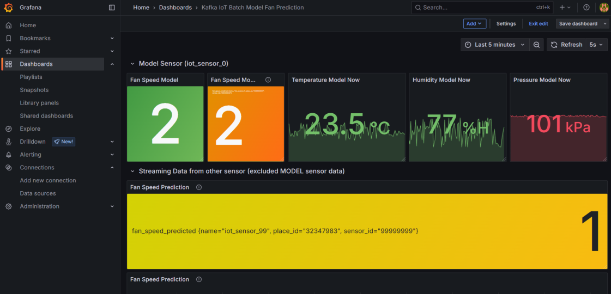

# Online Prediction

<!-- Online Prection ทำงานอย่างไร  -->
1. เชื่อมต่อ InfluxDB
2. Load Model
3. เชื่อมต่อ kafka
4. นำข้อมูลจาก kafka มา Predict
5. นำค่า Predict อัพโลหดไป InfluxDB

## ปิดการใช้งานของ Batch ML ดังนี้

1. Kafka-to-Jsonl
2. Train-from-data
3. Predict-them-influxdb

## เริ่มใช้งาน Online ML ดังนี้

1. docker compose down batch ml sercice
2. แก้ไฟล์ .env
3. docker compose up online ml service

## ผลที่ได้จากการใช้ ML มีดังนี้

<!-- แนบรูป Grafana  พร้อมอธิบาย -->

